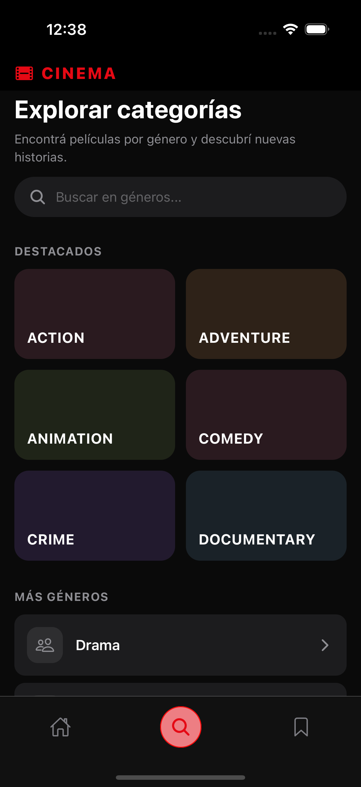
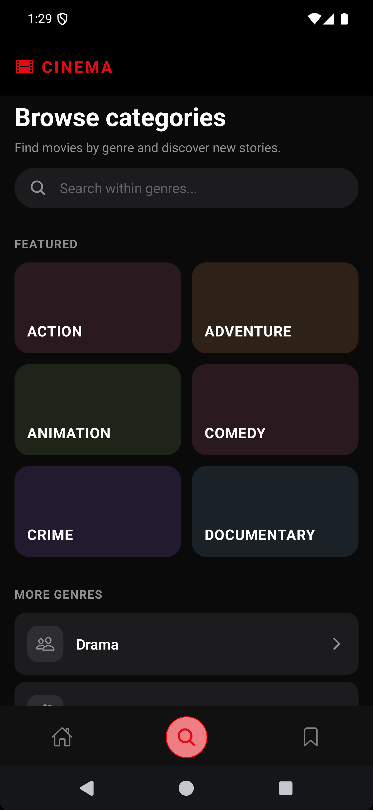

# 🎬 Movies App - React Native

Aplicación móvil desarrollada con Expo que permite explorar películas utilizando la API de The Movie Database (TMDb).

Este proyecto fue construido como parte de un test técnico, enfocándose en arquitectura limpia, consumo eficiente de datos, experiencia de usuario y uso de tecnologías modernas.

Como **aporte extra** se implementó un **filtro por categorías** (exploración por géneros vía API de TMDb), buscando brindar una **solución más completa** y una **aplicación más integral** que cubra también el descubrimiento de películas por género, además del flujo principal del requisito.

---

## 📸 Screenshots

### 🍏 Ios

| Home                                   | Detalle                                    | Watchlist                                        | Categories                                         |
| -------------------------------------- | ------------------------------------------ | ------------------------------------------------ | -------------------------------------------------- |
|  |  |  |  |

### 🤖 Android

| Home                                       | Detalle                                        | Watchlist                                            | Categories                                             |
| ------------------------------------------ | ---------------------------------------------- | ---------------------------------------------------- | ------------------------------------------------------ |
|  |  |  |  |

---

## 🎥 Demo (Para términos de pruebas el tiempo del recordatorio fue modificado)

**[Abrir demo en Google Drive →](https://drive.google.com/file/d/1XAQn7VuOzKGbTSDZMOKYtrTE7kj8TrXw/view?usp=sharing)**

## 🚀 Tecnologías utilizadas

- Expo
- TypeScript
- React Navigation
- TanStack Query
- Zustand
- Axios
- AsyncStorage
- Expo Notifications
- i18next + react-i18next + expo-localization (inglés y español según idioma del dispositivo)

---

## 📱 Funcionalidades principales

### 🎥 Exploración de películas

- Listado de películas populares desde TMDb
- Infinite scroll optimizado
- Renderizado eficiente con FlatList

---

### 🔍 Filtro avanzado

- Búsqueda por letra inicial
- Validación de:

  - Mínimo 3 géneros
  - Al menos 3 actores mujeres y 3 hombres

> Se implementa una estrategia en dos fases para optimizar rendimiento:
>
> 1. Filtro inicial por letra
> 2. Validación avanzada con datos de detalle y cast

---

### 🎬 Detalle de película

- Título, imagen, descripción
- Géneros
- Reparto

---

### ⭐ Watchlist

- Agregar / eliminar películas
- Estado global con Zustand
- Prevención de duplicados

---

### 📺 Pantalla Watchlist

- Visualización de películas guardadas
- Navegación al detalle

---

### 🌐 Modo Offline

- Persistencia con TanStack Query + AsyncStorage
- Visualización sin conexión
- Indicador offline
- Navegación funcional

---

### 🔔 Notificaciones inteligentes

- Recordatorio después de 3 minutos
- Cancelación automática si el usuario abre la película
- Prevención de duplicados
- Navegación al detalle desde la notificación

---

### 🗂️ Exploración por categorías (aporte extra)

- Tab dedicada para explorar géneros y filtrar películas por categoría (`/genre/movie/list`, `discover/movie` en TMDb)
- Búsqueda dentro de la lista de géneros y resultados en grid con infinite scroll, reutilizando el mismo patrón de tarjetas y navegación al detalle

---

## 🧠 Decisiones técnicas

### 📦 Arquitectura

```bash
src/
  api/
  services/
  hooks/
  store/
  screens/
  components/
  navigation/
  utils/
  types/
  i18n/

```

---

### ⚡ Manejo de datos

- TanStack Query para caching y sincronización
- useInfiniteQuery para paginación
- useQueries para múltiples requests optimizados

---

### 🧩 Estado global

- Zustand por simplicidad y bajo overhead
- Separación de responsabilidades entre watchlist y notificaciones

---

### 🌐 Offline-first

- Persistencia automática del cache
- Estrategia offline-first

---

### 🔔 Notificaciones

- Implementación desacoplada
- Control de duplicados mediante store
- Navegación programática

---

## ⚙️ Instalación y ejecución

Sigue estos pasos para correr la aplicación localmente:

---

### 1. Clonar el repositorio

```bash
git clone https://github.com/TU_USUARIO/movies-app.git
cd movies-app
```

---

### 2. Instalar dependencias

```bash
npm install
```

---

### 3. Configurar variables de entorno

Crea un archivo `.env` en la raíz del proyecto:

```env
EXPO_PUBLIC_TMDB_API_KEY=tu_api_key
EXPO_PUBLIC_BASE_URL=https://api.themoviedb.org/3
```

> Puedes obtener tu API key desde la documentación oficial de The Movie Database API.

---

### 4. Development build (recomendado para funcionalidad completa)

Este proyecto incluye **`expo-dev-client`** y plugins nativos (por ejemplo **`expo-notifications`**). Eso implica que **Expo Go no es suficiente** para un comportamiento equivalente al de producción: las notificaciones locales, el **plugin de notificaciones** en `app.json` y otros módulos nativos se compilán **dentro de tu propio binario**. Del mismo modo, **`expo-localization`** usa APIs del sistema para el idioma; un **development build** evita diferencias entre lo que ves en Expo Go y lo que obtendrás en un build release.

**Resumen:** para probar notificaciones, permisos y el stack nativo real, genera e instala un **development build** en emulador o dispositivo.

#### Requisitos previos

- **macOS + Xcode** (simulador o dispositivo iOS), **Android Studio + SDK** (emulador o dispositivo Android), o **EAS Build** en la nube.

#### Generar e instalar el binario de desarrollo (local)

1. Instala dependencias (paso 2) y configura `.env` (paso 3).

2. Genera los proyectos nativos y compila (en la raíz del repo):

   **Android**

   ```bash
   npx expo run:android
   ```

   **iOS**

   ```bash
   npx expo run:ios
   ```

   Esto aplica la configuración de `app.json` (plugins, permisos de iOS, `infoPlist`, etc.) y deja instalada la app en el emulador o dispositivo conectado.

3. Arranca Metro apuntando al **dev client** (no uses Expo Go):

   ```bash
   npm run start:dev
   ```

   o:

   ```bash
   npx expo start --dev-client
   ```

4. Abre la app **Movies App** (tu development build) en el dispositivo/emulador; debería conectarse al bundler. Ahí puedes validar notificaciones locales, deep links y el resto del flujo nativo.

> Si prefieres no compilar en local, puedes usar **[EAS Build](https://docs.expo.dev/build/introduction/)** con un perfil `development` y el mismo `expo-dev-client`, instalar el `.apk` / `.ipa` generado y luego ejecutar `npx expo start --dev-client`.

---

### 5. Ejecutar en modo rápido (Expo Go — limitado)

```bash
npx expo start
```

Puedes abrir el proyecto en **Expo Go** escaneando el QR. Ten en cuenta que **algunas capacidades nativas** (sobre todo **notificaciones** con la configuración del plugin de este repo) **no se comportarán igual** que en un development build o en release. Úsalo solo para explorar la UI; para **notificaciones y pruebas finales**, usa el **paso 4**.

---

### 6. Ejecutar en dispositivo físico (Expo Go)

1. Instala **Expo Go**
2. Escanea el código QR del paso 5

---

## 📌 Notas

- Para **notificaciones** y pruebas fieles al entorno real, usa el **development build** (paso 4), no solo Expo Go. y recuerda habilitar el permiso de notificaciones en la app.
- La primera carga requiere conexión a internet
- Luego la app funciona en modo offline

---

## 👨‍💻 Autor

Desarrollado por Daniel Ramirez - Ingeniero informatico.
