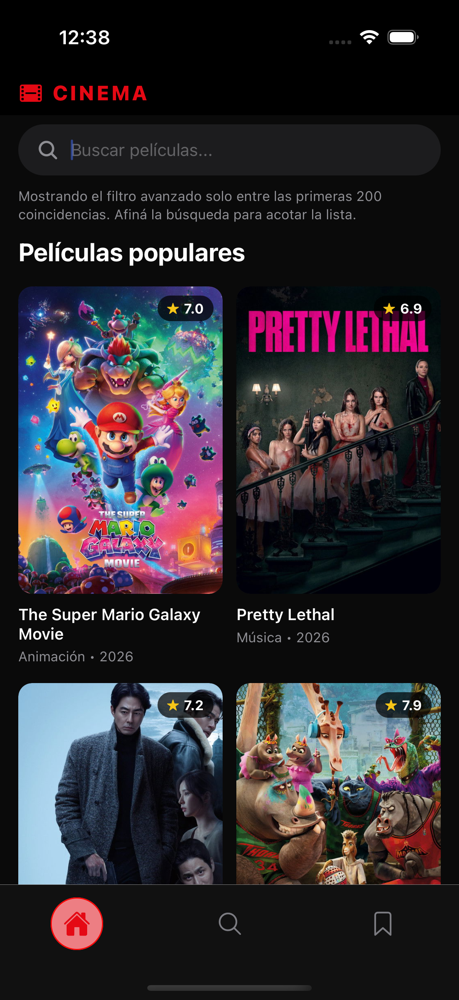
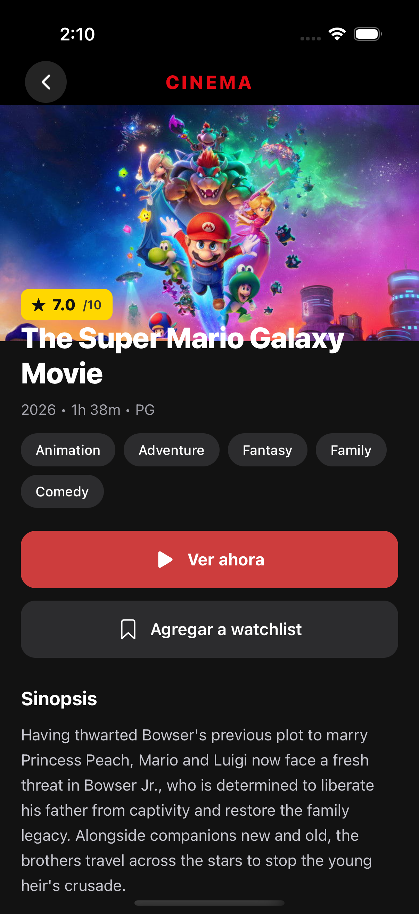
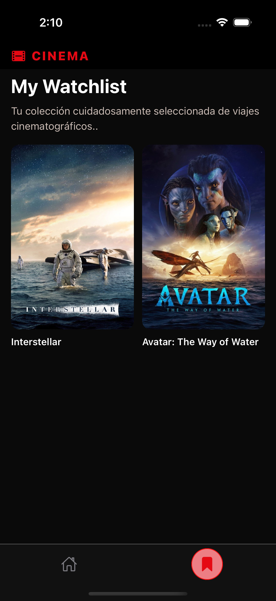
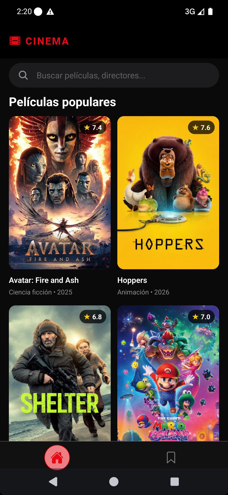
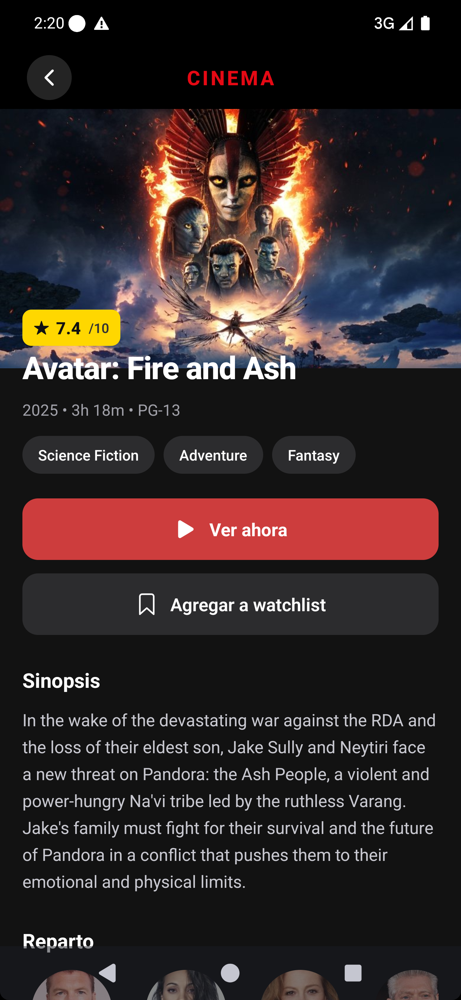
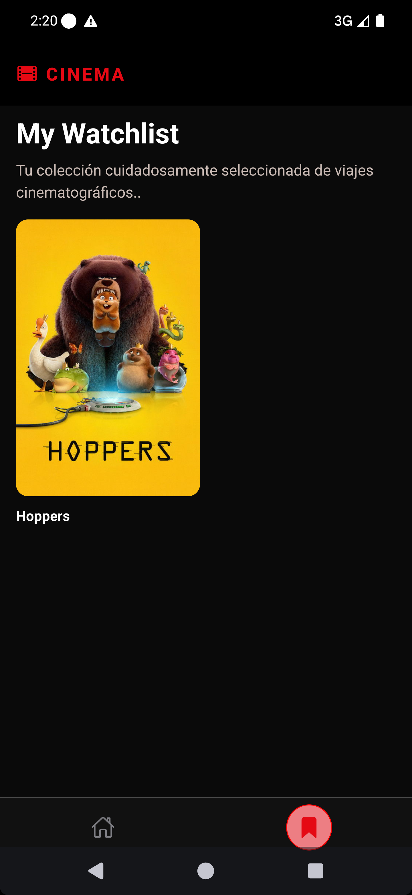

# 🎬 Movies App - React Native

Aplicación móvil desarrollada con Expo que permite explorar películas utilizando la API de The Movie Database (TMDb).

Este proyecto fue construido como parte de un test técnico, enfocándose en arquitectura limpia, consumo eficiente de datos, experiencia de usuario y uso de tecnologías modernas.

---

## 📸 Screenshots

### 🍏 Ios

| Home                                   | Detalle                                    | Watchlist                                        |
| -------------------------------------- | ------------------------------------------ | ------------------------------------------------ |
|  |  |  |

### 🤖 Android

| Home                                       | Detalle                                        | Watchlist                                            |
| ------------------------------------------ | ---------------------------------------------- | ---------------------------------------------------- |
|  |  |  |

---

## 🎥 Demo (Para términos de pruebas el tiempo del recordatorio fue modificado)

**[Abrir demo en Google Drive →](https://drive.google.com/file/d/1XAQn7VuOzKGbTSDZMOKYtrTE7kj8TrXw/view?usp=sharing)**

## 🚀 Tecnologías utilizadas

- Expo
- TypeScript
- React Navigation
- TanStack Query
- Zustand
- Axios
- AsyncStorage
- Expo Notifications

---

## 📱 Funcionalidades principales

### 🎥 Exploración de películas

- Listado de películas populares desde TMDb
- Infinite scroll optimizado
- Renderizado eficiente con FlatList

---

### 🔍 Filtro avanzado

- Búsqueda por letra inicial
- Validación de:

  - Mínimo 3 géneros
  - Al menos 3 actores mujeres y 3 hombres

> Se implementa una estrategia en dos fases para optimizar rendimiento:
>
> 1. Filtro inicial por letra
> 2. Validación avanzada con datos de detalle y cast

---

### 🎬 Detalle de película

- Título, imagen, descripción
- Géneros
- Reparto

---

### ⭐ Watchlist

- Agregar / eliminar películas
- Estado global con Zustand
- Prevención de duplicados

---

### 📺 Pantalla Watchlist

- Visualización de películas guardadas
- Navegación al detalle

---

### 🌐 Modo Offline

- Persistencia con TanStack Query + AsyncStorage
- Visualización sin conexión
- Indicador offline
- Navegación funcional

---

### 🔔 Notificaciones inteligentes

- Recordatorio después de 3 minutos
- Cancelación automática si el usuario abre la película
- Prevención de duplicados
- Navegación al detalle desde la notificación

---

## 🧠 Decisiones técnicas

### 📦 Arquitectura

```bash
src/
  api/
  services/
  hooks/
  store/
  screens/
  components/
  navigation/
  utils/
  types/
```

---

### ⚡ Manejo de datos

- TanStack Query para caching y sincronización
- useInfiniteQuery para paginación
- useQueries para múltiples requests optimizados

---

### 🧩 Estado global

- Zustand por simplicidad y bajo overhead
- Separación de responsabilidades entre watchlist y notificaciones

---

### 🌐 Offline-first

- Persistencia automática del cache
- Estrategia offline-first

---

### 🔔 Notificaciones

- Implementación desacoplada
- Control de duplicados mediante store
- Navegación programática

---

## ⚙️ Instalación y ejecución

Sigue estos pasos para correr la aplicación localmente:

---

### 1. Clonar el repositorio

```bash
git clone https://github.com/TU_USUARIO/movies-app.git
cd movies-app
```

---

### 2. Instalar dependencias

```bash
npm install
```

---

### 3. Configurar variables de entorno

Crea un archivo `.env` en la raíz del proyecto:

```env
EXPO_PUBLIC_TMDB_API_KEY=tu_api_key
EXPO_PUBLIC_BASE_URL=https://api.themoviedb.org/3
```

> Puedes obtener tu API key desde la documentación oficial de The Movie Database API.

---

### 4. Ejecutar la aplicación

```bash
npx expo start
```

Esto abrirá el panel de Expo donde puedes ejecutar la app en:

- 📱 Dispositivo físico (Expo Go)
- 🤖 Emulador Android
- 🍏 Simulador iOS
- 🌐 Navegador

---

### 5. Ejecutar en dispositivo físico (recomendado)

1. Instala **Expo Go**
2. Escanea el código QR

---

## 📌 Notas

- Se recomienda probar en dispositivo físico para validar notificaciones
- La primera carga requiere conexión a internet
- Luego la app funciona en modo offline

---

## 👨‍💻 Autor

Desarrollado por Daniel Ramirez - Ingeniero informatico.
